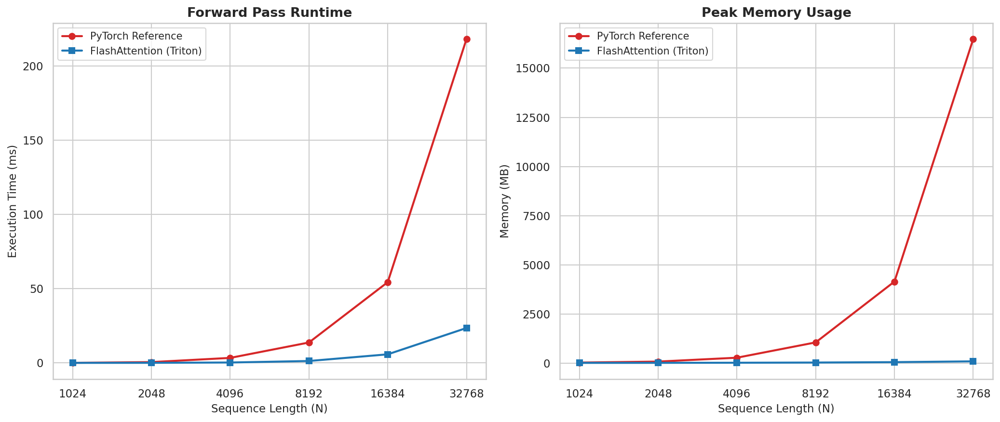
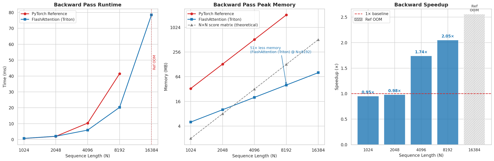
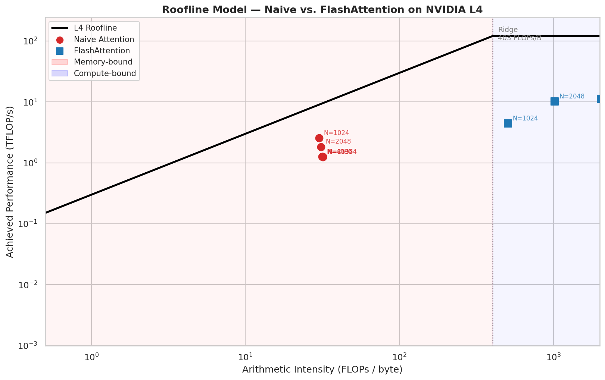
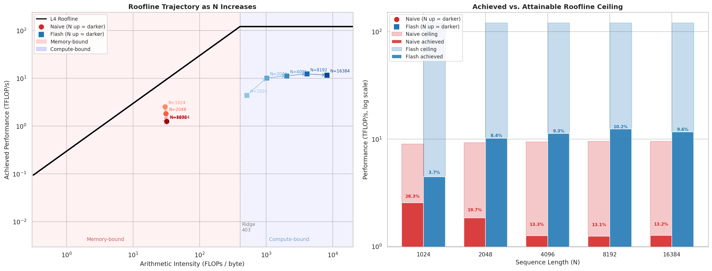
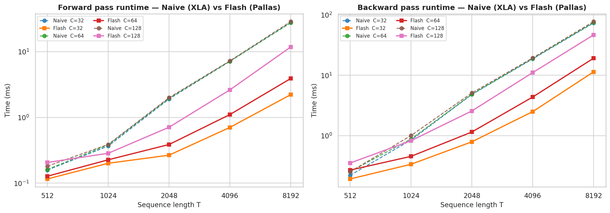
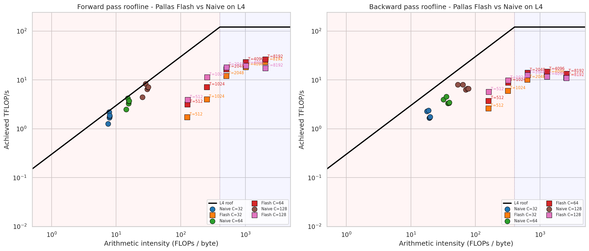
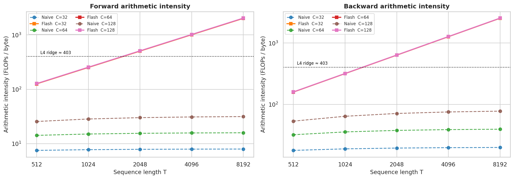

# Flash Attention Experiments

This repository contains notebook-based experiments and benchmark visualizations for Flash Attention implementations, including Triton and Pallas variants.

## Notebook Overview

### `trition_attn.ipynb` (Triton FlashAttention walkthrough)

This notebook is a full systems-style build of a Triton FlashAttention implementation, developed in stages and validated along the way:

- starts from tiled forward-pass scaffolding and incrementally builds the full kernel (Q/K/V tile loading, score computation, online softmax, output writeback),
- benchmarks forward pass throughput and then analyzes arithmetic intensity and roofline position,
- implements a custom backward kernel, checks correctness against PyTorch autograd gradients, and wraps everything in a `torch.autograd.Function`,
- benchmarks backward pass performance, estimates occupancy, and includes profiling/roofline efficiency decomposition.

It is the "from-kernel-construction-to-performance-analysis" notebook for the Triton path.

### `pallas_attn_gpt2.ipynb` (Pallas attention in GPT-2 training context)

This notebook focuses on integrating and evaluating Pallas-based attention in a GPT-2 style workload rather than only isolated kernel snippets:

- compares attention variants (including a naive XLA path and a Pallas Flash-style path),
- measures end-to-end training speed for GPT-2 124M settings,
- runs kernel-level roofline analysis for naive vs Pallas Flash implementations,
- uses shared utility helpers for throughput and roofline calculations to keep comparisons consistent.

It is the "model-training + kernel-roofline" notebook for the Pallas path.

## Results Overview (L4 GPU runs in notebooks)

- **Triton forward scaling (`trition_attn.ipynb`):** speedup grows with sequence length (for example, `6.22x` at `N=2048`, `11.27x` at `N=4096`, and `9.27x` at `N=32768`).
- **Triton memory scaling:** at `N=32768`, reference forward uses about `16477 MB` while Triton uses about `94 MB`; in backward, reference OOMs at `N=16384` while Triton completes (`~78.5 ms`, `~80 MB` incremental memory).
- **Pallas end-to-end GPT-2 throughput (`pallas_attn_gpt2.ipynb`):** `xla ~18k tok/s`, `pallas ~29k tok/s`, `cudnn ~35k tok/s` (`pallas` is about `1.6x` over `xla` in this setup).
- **Pallas kernel-level sweep:** Flash-style kernels show largest gains at long contexts (forward up to `12.45x`, backward up to `7.48x` in the reported `(T, C)` grid).
- **Roofline signal:** arithmetic intensity jumps strongly for Flash-style kernels (for example at `T=2048, C=64`, forward AI from `~15.5` to `~508 FLOPs/byte`), matching the shift away from memory-bound behavior.

### Selected Figures

#### Triton notebook outputs

#### Pallas notebook outputs

## Repository Layout

- `utils/` - plotting, roofline, and timing helper utilities.
- `results/` - generated benchmark figures and roofline plots.

## Quick Start

1. Create and activate a Python environment.
2. Install your required JAX/Triton/plotting dependencies.
3. Open the notebooks and run cells to reproduce experiments.
